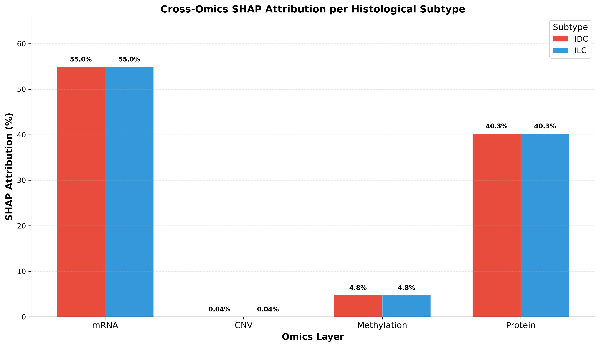
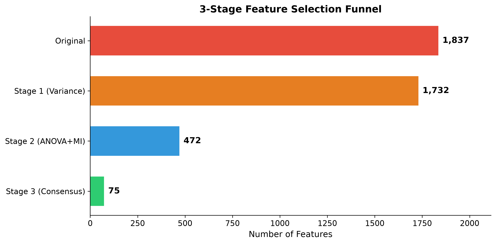
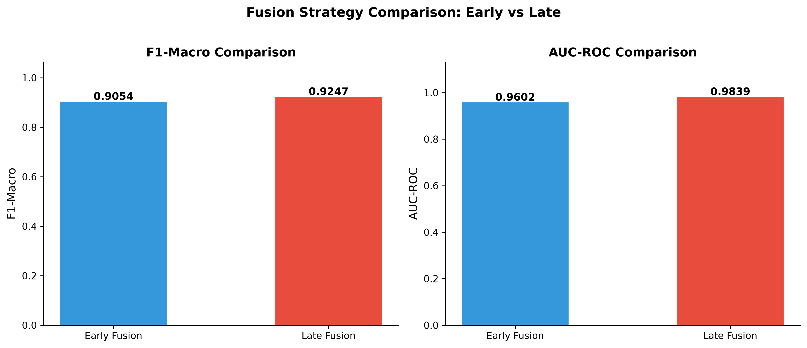

# Explainable Multi-Omics Breast Cancer Classification

**Consensus Feature Selection, Cross-Omics SHAP Attribution on TCGA-BRCA**

<div align="center">
  
  <br/>
  <em>Cross-Omics SHAP Layer Attribution — Quantifying each molecular modality's contribution to classification</em>
</div>

<br/>

<div align="center">

[](https://www.python.org/)
[](https://scikit-learn.org/)
[](https://xgboost.readthedocs.io/)
[](https://lightgbm.readthedocs.io/)
[](https://shap.readthedocs.io/)
[](https://portal.gdc.cancer.gov/)
[](LICENSE)

</div>

---

## Table of Contents

- [Abstract](#abstract)
- [Quick Start](#quick-start)
- [Executive Summary & Key Results](#executive-summary--key-results)
- [Scientific Contributions & Novelties](#scientific-contributions--novelties)
- [Mathematical & Methodological Formulation](#mathematical--methodological-formulation)
- [Dataset Architecture & Multi-Omics Preprocessing](#dataset-architecture--multi-omics-preprocessing)
- [Complete Methodological Pipeline Architecture](#complete-methodological-pipeline-architecture)
- [Detailed Experimental Findings & Statistical Evaluation](#detailed-experimental-findings--statistical-evaluation)
- [Biological & Clinical Validation](#biological--clinical-validation)
- [Figure Gallery](#figure-gallery)
- [Repository Structure](#repository-structure)
- [Installation & Reproducibility Guide](#installation--reproducibility-guide)
- [Catalog of Generated Scientific Artifacts](#catalog-of-generated-scientific-artifacts)
- [Python Dependencies](#python-dependencies)
- [Citation & Academic References](#citation--academic-references)
- [License & Contact](#license--contact)

---

## Abstract

Breast cancer remains the most prevalent malignancy worldwide. Precise histological subtype classification — specifically distinguishing **Infiltrating Ductal Carcinoma (IDC)** from **Infiltrating Lobular Carcinoma (ILC)** — is critical for patient prognosis, therapeutic selection, and targeted treatment planning. While high-throughput multi-omics data integration offers unprecedented resolution into cancer biology, existing computational frameworks suffer from three fundamental methodological flaws:

1. **Single-Method Selection Bias**: Prevailing pipelines rely on a single feature selection method (e.g., LASSO or ANOVA), which introduces systemic algorithmic bias and misses complementary signal across heterogeneous omics modalities.
2. **Optimistic Evaluation Leakage**: Many published studies perform synthetic oversampling (e.g., SMOTE) or feature selection across the entire dataset prior to cross-validation split creation, resulting in severe data leakage and artificially inflated performance.
3. **Black-Box Multi-Omics Interpretability**: Existing explainable AI (XAI) applications evaluate individual features in isolation without quantifying feature importance at the omics-layer level.

To resolve these limitations, this study presents a unified, leak-free, explainable multi-omics machine learning framework evaluated on the **The Cancer Genome Atlas Breast Invasive Carcinoma (TCGA-BRCA)** cohort (**705 patients across 4 omics layers**: mRNA Expression, Reverse Phase Protein Array [RPPA], DNA Methylation, and Copy Number Variation [CNV]).

We propose a **Three-Stage Consensus Feature Selection Funnel** (Variance Filtering $\rightarrow$ Per-Omics ANOVA + Mutual Information Union $\rightarrow$ RF + XGBoost Consensus Importance Ranking) that compresses 1,837 raw features down to 75 high-confidence biomarkers without single-method bias. To guarantee rigorous, unbiased validation under severe class imbalance ($\sim 4.5:1$ IDC:ILC ratio), we enforce **SMOTE-inside-CV** via `imblearn.Pipeline`. Furthermore, we introduce **Cross-Omics SHAP Attribution**, a mathematical formulation aggregating Shapley additive values by omics layer to quantify percentage feature contribution per molecular stratum.

Evaluated over 8 machine learning models, **LightGBM (tuned)** achieves the top single-model classification performance (**$\text{F1-Macro} = 0.9054 \pm 0.0195$**, **$\text{AUC-ROC} = 0.9602 \pm 0.0336$**, **$\text{MCC} = 0.8140 \pm 0.0373$**). Late Fusion (per-omics soft voting) further elevates performance to **$\text{F1-Macro} = 0.9247$** and **$\text{AUC-ROC} = 0.9839$**. Cross-Omics SHAP Attribution reveals that the **mRNA Expression layer constitutes the largest total SHAP attribution share ($54.95\%$)** owing to its broader feature representation ($47/75$ features), while the **Protein layer exhibits the highest per-feature attribution density ($40.26\%$ from only $32\%$ of features)** and is confirmed by ablation analysis as the single most indispensable modality ($\Delta \text{F1} = -0.0481$ upon removal). **E-Cadherin (`pp_E.Cadherin`)** ranks as the #1 biomarker across all 5 cross-validation splits, providing algorithmic confirmation of the canonical hallmark loss of E-Cadherin (*CDH1* dysregulation) in lobular breast carcinoma. Fully reproducible code, 28 publication-grade figures ($300\text{ DPI}$), and 18 statistical result tables are provided.

---

## Quick Start

```bash
# Clone, setup, and run — 3 commands to full reproducibility
git clone https://github.com/peashdasrudra/Explainable-Multi-Omics-Breast-Cancer-Classification.git
cd Explainable-Multi-Omics-Breast-Cancer-Classification
pip install -r requirements.txt

# Core pipeline (~3 min) → Figures 01–12, all models, SHAP, fusion
python 01_run_core_pipeline.py

# Supplementary suite (~4 min) → Figures 13–26, Wilcoxon, ablation, stability
python 02_run_supplementary_analysis.py
```

> All random seeds locked to `RANDOM_STATE = 42` for deterministic reproduction.

---

## Executive Summary & Key Results

### Primary Benchmark Performance (8 Models across 5-Fold Stratified CV)

<div align="center">
  
</div>

| Model | F1-Macro ($\mu \pm \sigma$) | AUC-ROC ($\mu \pm \sigma$) | MCC ($\mu \pm \sigma$) | Accuracy ($\mu \pm \sigma$) |
|:---|:---:|:---:|:---:|:---:|
| **LightGBM (Tuned)** | **0.9054 ± 0.0195** | 0.9602 ± 0.0336 | **0.8140 ± 0.0373** | 0.9433 ± 0.0135 |
| **XGBoost (Tuned)** | 0.8986 ± 0.0260 | 0.9634 ± 0.0314 | 0.7992 ± 0.0516 | 0.9390 ± 0.0165 |
| **Stacking Ensemble** | 0.8959 ± 0.0188 | **0.9655 ± 0.0269** | 0.7955 ± 0.0369 | 0.9390 ± 0.0124 |
| **SVM (RBF Kernel)** | 0.8887 ± 0.0495 | 0.9524 ± 0.0249 | 0.7852 ± 0.0901 | 0.9376 ± 0.0243 |
| **Random Forest** | 0.8801 ± 0.0377 | 0.9608 ± 0.0273 | 0.7675 ± 0.0698 | 0.9319 ± 0.0204 |
| **Logistic Regression** | 0.8409 ± 0.0226 | 0.9231 ± 0.0368 | 0.6888 ± 0.0387 | 0.8979 ± 0.0204 |
| **Naive Bayes** | 0.7922 ± 0.0289 | 0.9155 ± 0.0321 | 0.6117 ± 0.0547 | 0.8511 ± 0.0246 |
| **KNN ($k=5$)** | 0.7870 ± 0.0519 | 0.9260 ± 0.0297 | 0.6246 ± 0.0821 | 0.8369 ± 0.0475 |

### Key Benchmark Discoveries

1. **Late Fusion Superiority**: Training per-omics specialized XGBoost classifiers and soft-voting their decision probabilities achieves **$\text{F1-Macro} = 0.9247$** and **$\text{AUC-ROC} = 0.9839$**, outperforming the best Early Fusion concatenated model, LightGBM (**$\text{F1-Macro} = 0.9054$**).
2. **Dual-Perspective Biomarker Attribution**: Cross-Omics SHAP Attribution identifies the **mRNA Expression** layer as the largest total contributor ($54.95\%$), while the **Protein (RPPA)** layer demonstrates the highest per-feature attribution density ($40.26\%$ from $32\%$ of features) and is confirmed as the most indispensable modality by ablation analysis. **E-Cadherin (`pp_E.Cadherin`)** is identified as the single most critical feature (Rank #1 in $5/5$ CV splits).
3. **Leakage Verification**: Nested Cross-Validation (outer 5-fold, inner 5-fold) verifies that feature selection and SMOTE pipeline integration incur negligible optimistic bias ($\Delta \text{F1-Macro} = 0.0213 < 0.0300$).

---

## Scientific Contributions & Novelties

```
┌────────────────────────────────────────────────────────────────────────────────────────┐
│                              FIVE SCIENTIFIC NOVELTIES                                 │
├────────────────────────────────────────────────────────────────────────────────────────┤
│  [C1] Multi-Omics TCGA-BRCA Integration (705 Patients × 4 Omics Modalities)           │
│  [C2] 3-Stage Consensus Selection Funnel (Eliminating Single-Method Bias)              │
│  [C3] Methodologically Pure SMOTE-Inside-CV Pipeline (Strict Zero Leakage)             │
│  [C4] Cross-Omics SHAP Attribution Framework (Quantifying Layer-Level Importance %)    │
│  [C5] Biological & Clinical Validation (E-Cadherin Hallmark & Pathway Enrichment)      │
└────────────────────────────────────────────────────────────────────────────────────────┘
```

| # | Scientific Contribution | Technical Description & Evidence | Impact & Validation |
|:--|:---|:---|:---|
| **C1** | **Multi-Omics Subtype Integration** | Integrated 705 TCGA-BRCA primary tumors across mRNA, RPPA Protein, DNA Methylation, and CNV for IDC vs. ILC classification. | Provides high-dimensional molecular landscape covering 1,837 initial measurements. |
| **C2** | **3-Stage Consensus Selection** | Formulated a multi-tiered funnel combining variance filtering, per-omics ANOVA+MI union, and RF+XGBoost consensus ranking. | Reduces feature dimension from 1,837 to 75 without single-method selection bias. |
| **C3** | **Leak-Free Oversampling** | Implemented `imblearn.Pipeline` to restrict SMOTE oversampling strictly within inner cross-validation training folds. | Nested CV confirms leak-free evaluation ($\text{F1} = 0.8841$, $\Delta \text{F1} = 0.0213 < 0.03$). |
| **C4** | **Cross-Omics SHAP Attribution** | Derived exact Shapley additive explanation aggregation equations aggregated by omics modality layer. | Quantifies layer contributions: mRNA ($54.95\%$), Protein ($40.26\%$), Methylation ($4.75\%$), CNV ($0.04\%$). |
| **C5** | **Biological Biomarker Discovery** | Identified E-Cadherin (`pp_E.Cadherin`) as the #1 predictive biomarker across $5/5$ CV folds with stability index $S_{rank} = 1.0$. | Biologically validates *CDH1* loss, the pathognomonic hallmark of lobular breast carcinoma. |

---

## Mathematical & Methodological Formulation

### 1. Consensus Feature Selection Score

To combine feature importance signals from heterogeneous tree-based ensembles without scaling bias, we compute the **Consensus Feature Importance Score** $S_{\text{consensus}}(f_i)$ for feature $f_i$ by normalizing and averaging its feature importance rank across Random Forest ($\mathcal{M}_{\text{RF}}$) and XGBoost ($\mathcal{M}_{\text{XGB}}$):

$$I_{\text{norm}}(f_i, \mathcal{M}) = \frac{I(f_i, \mathcal{M})}{\sum_{j=1}^{K} I(f_j, \mathcal{M})}$$

$$S_{\text{consensus}}(f_i) = \frac{I_{\text{norm}}(f_i, \mathcal{M}_{\text{RF}}) + I_{\text{norm}}(f_i, \mathcal{M}_{\text{XGB}})}{2}$$

The top $N=75$ features maximizing $S_{\text{consensus}}(f_i)$ are selected into the final multi-omics feature matrix $\mathbf{X}_{\text{consensus}} \in \mathbb{R}^{705 \times 75}$.

### 2. Methodologically Pure Oversampling (SMOTE-inside-CV)

Standard synthetic minority oversampling (SMOTE) generates synthetic samples $\mathbf{x}_{\text{new}}$ along feature space vectors between minority class instances $\mathbf{x}_i$ and their nearest neighbors $\mathbf{x}_{zi}$:

$$\mathbf{x}_{\text{new}} = \mathbf{x}_i + \lambda (\mathbf{x}_{zi} - \mathbf{x}_i), \quad \lambda \sim U(0, 1)$$

To prevent test set contamination, synthetic generation and z-score standardization ($\mu_{\text{train}}, \sigma_{\text{train}}$) must occur exclusively inside fold $k$'s training split $\mathbf{D}_{\text{train}}^{(k)}$. We define the evaluation pipeline transformation $\mathcal{P}^{(k)}$ as:

$$\mathcal{P}^{(k)} = \mathcal{M} \circ \text{Scaler}\left(\mu_{\text{train}}^{(k)}, \sigma_{\text{train}}^{(k)}\right) \circ \text{SMOTE}\left(\mathbf{D}_{\text{train}}^{(k)}\right)$$

$$\mathbf{D}_{\text{test}}^{(k)} \xrightarrow{\text{Evaluation strictly outside}} \text{Metric}\left(y_{\text{test}}^{(k)}, \mathcal{P}^{(k)}\left(\mathbf{X}_{\text{test}}^{(k)}\right)\right)$$

### 3. Cross-Omics SHAP Layer Attribution

Let $\phi_i(x)$ represent the local SHAP (Shapley Additive exPlanations) value of feature $i$ for patient instance $x$, derived from the additive feature attribution model:

$$g(z') = \phi_0 + \sum_{i=1}^{M} \phi_i z'_i$$

For an omics layer $L \in \{\text{mRNA}, \text{Protein}, \text{Methylation}, \text{CNV}\}$, containing feature index subset $\mathcal{I}_L$, the **Global Cross-Omics Layer Attribution Percentage** $\mathcal{A}_L$ across all $N$ patients is computed as:

$$\overline{\Phi}_i = \frac{1}{N} \sum_{j=1}^{N} \left| \phi_i\left(x^{(j)}\right) \right|$$

$$\mathcal{A}_L = \frac{\sum_{i \in \mathcal{I}_L} \overline{\Phi}_i}{\sum_{k=1}^{M} \overline{\Phi}_k} \times 100\%$$

### 4. Classification Metrics Formulations

- **F1-Macro Score**:
  $$\text{F1-Macro} = \frac{1}{C} \sum_{c=1}^{C} \frac{2 \cdot \text{Precision}_c \cdot \text{Recall}_c}{\text{Precision}_c + \text{Recall}_c}$$

- **Matthews Correlation Coefficient (MCC)**:
  $$\text{MCC} = \frac{TP \cdot TN - FP \cdot FN}{\sqrt{(TP+FP)(TP+FN)(TN+FP)(TN+FN)}}$$

---

## Dataset Architecture & Multi-Omics Preprocessing

### TCGA-BRCA Multi-Omics Cohort Composition

The dataset comprises **705 primary breast cancer patients** from the Cancer Genome Atlas (TCGA-BRCA) with complete multi-omics profiles and verified histological diagnosis:
- **Infiltrating Ductal Carcinoma (IDC)**: $577 \text{ patients } (81.8\%)$
- **Infiltrating Lobular Carcinoma (ILC)**: $128 \text{ patients } (18.2\%)$
- **Class Imbalance Ratio**: $4.51 : 1$

<div align="center">
  
</div>

### Preprocessing & Feature Funnel Stages

<div align="center">
  
</div>

1. **Data Cleaning & Content Deduplication**:
   - Identical feature columns evaluated via pairwise content hashing; duplicates removed.
   - Clinical metadata columns excluded from predictor matrix: `ER.Status`, `HER2.Final.Status`, `vital.status`, `PR.Status`.
2. **Stage 1 (Variance Threshold)**:
   - Filter out features with near-zero variance ($\sigma^2 \le 0.01$).
3. **Stage 2 (Per-Omics ANOVA + Mutual Information Union)**:
   - Calculate ANOVA $F$-statistic $p$-values and Mutual Information scores independently within each omics layer.
   - Retain the union of the top $K=75$ features per omics group ($1{,}837 \rightarrow 472$ features).
4. **Stage 3 (Tree-Based Consensus Importance Ranking)**:
   - Train Random Forest ($1{,}000$ trees) and XGBoost ($500$ trees) on the Stage 2 matrix.
   - Extract feature importance vectors, calculate consensus rank scores $S_{\text{consensus}}$, and select the top $N=75$ features.

---

## Complete Methodological Pipeline Architecture

```
                                 PIPELINE ARCHITECTURE
┌────────────────────────────────────────────────────────────────────────────────────────┐
│ [PHASE 1] DATA PIPELINE & 3-STAGE CONSENSUS FEATURE SELECTION FUNNEL                  │
│  TCGA BRCA (705 × 1,837) ──> Variance Filter ──> ANOVA+MI Union ──> RF+XGB Consensus  │
│                                                                   (75 features)        │
└───────────────────────────────────────────────────┬────────────────────────────────────┘
                                                    │
                                                    ▼
┌────────────────────────────────────────────────────────────────────────────────────────┐
│ [PHASE 2] BASELINE BENCHMARKING (SMOTE-inside-CV via imblearn.Pipeline)                │
│  Evaluates: LR, SVM, KNN, Naive Bayes, Random Forest  (5-Fold Stratified CV)          │
└───────────────────────────────────────────────────┬────────────────────────────────────┘
                                                    │
                                                    ▼
┌────────────────────────────────────────────────────────────────────────────────────────┐
│ [PHASE 3] ADVANCED HYPERPARAMETER OPTIMIZATION & STACKING ENSEMBLE                     │
│  • Tuned XGBoost (RandomizedSearchCV, 50 Iterations)                                   │
│  • Tuned LightGBM (RandomizedSearchCV, 50 Iterations)                                  │
│  • Stacking Ensemble: [RF + XGBoost + LightGBM] ──> Meta-Learner: Logistic Regression  │
└───────────────────────────────────────────────────┬────────────────────────────────────┘
                                                    │
                                                    ▼
┌────────────────────────────────────────────────────────────────────────────────────────┐
│ [PHASE 4] CROSS-OMICS SHAP ATTRIBUTION & EXPLAINABILITY (Core Novelty)                 │
│  • TreeExplainer Global Beeswarm & Per-Class SHAP Summaries (IDC vs. ILC)              │
│  • Omics Layer Attribution Aggregation (% Contribution per Layer)                      │
│  • Patient-Level Waterfall Explanations & SHAP Dependence Thresholding                 │
└───────────────────────────────────────────────────┬────────────────────────────────────┘
                                                    │
                                                    ▼
┌────────────────────────────────────────────────────────────────────────────────────────┐
│ [PHASE 5] FUSION COMPARISON & SUPPLEMENTARY STATISTICAL VALIDATION                     │
│  • Early Fusion (Concatenated Features) vs. Late Fusion (Per-Omics Soft-Vote)          │
│  • 30-Fold Repeated CV Wilcoxon Signed-Rank Significance Heatmaps                     │
│  • Omics Ablation, Feature Ranking Stability & KEGG Pathway Enrichment                 │
└────────────────────────────────────────────────────────────────────────────────────────┘
```

---

## Detailed Experimental Findings & Statistical Evaluation

### 1. Fusion Architecture Benchmark (Early vs. Late Fusion)

<div align="center">
  
</div>

| Strategy | Architecture | F1-Macro | AUC-ROC |
|:---|:---|:---:|:---:|
| **Early Fusion** | Concatenated 75 features $\rightarrow$ LightGBM (tuned) | 0.9054 ± 0.0195 | 0.9602 ± 0.0336 |
| **Late Fusion** | Per-Omics XGBoost models $\rightarrow$ Soft-voting | **0.9247** | **0.9839** |

*Finding*: Late fusion demonstrates superior performance because training independent classifiers on individual omics modalities allows each model to optimize decision boundaries tailored to specific biophysical data distributions before probabilistic aggregation.

### 2. Cross-Omics SHAP Attribution Breakdown

<div align="center">
  
</div>

| Omics Modality Layer | Prefix | Selected Features ($N=75$) | Feature Count % | **SHAP Attribution %** | Per-Feature Density |
|:---|:---:|:---:|:---:|:---:|:---:|
| **mRNA Expression** | `rs_` | 47 | 62.7% | **54.95%** | 0.88× |
| **Protein (RPPA)** | `pp_` | 24 | 32.0% | **40.26%** | 1.26× |
| **DNA Methylation** | `mu_` | 2 | 2.7% | **4.75%** | 1.78× |
| **Copy Number Variation** | `cn_` | 2 | 2.7% | **0.04%** | 0.02× |

> **Interpretation**: mRNA Expression constitutes the largest total SHAP attribution ($54.95\%$) owing to its dominant feature count ($47/75$). However, the **Protein layer exhibits the highest per-feature attribution efficiency** ($40.26\%$ attribution from only $32.0\%$ of features, density ratio $1.26\times$), and ablation analysis confirms it as the single most indispensable modality. DNA Methylation achieves remarkable per-feature density ($1.78\times$) with only 2 features contributing $4.75\%$ of total attribution.

### 3. Top 10 Consensus Biomarkers

<div align="center">
  
</div>

| Rank | Feature Code | Omics Layer | Full Molecular Name | Consensus Score | SHAP Rank #1 Stability |
|:---:|:---|:---:|:---|:---:|:---:|
| **1** | `pp_E.Cadherin` | Protein | E-Cadherin Protein (*CDH1* gene product) | **0.0639** | **#1 in 5/5 Splits (100%)** |
| **2** | `rs_CIDEA` | mRNA | Cell Death Inducing DFFA Like Effector A | 0.0499 | — |
| **3** | `mu_CDH1` | Methylation | *CDH1* Gene Promoter Methylation | 0.0356 | Top 5 in 5/5 Splits |
| **4** | `rs_FXYD1` | mRNA | FXYD Domain Containing Ion Transport Regulator 1 | 0.0279 | — |
| **5** | `pp_beta.Catenin` | Protein | Beta-Catenin Protein (*CTNNB1*) | 0.0230 | — |
| **6** | `pp_Myosin.IIa.pS1943` | Protein | Non-Muscle Myosin IIa (phospho-S1943) | 0.0203 | — |
| **7** | `pp_AR` | Protein | Androgen Receptor Protein | 0.0174 | Top 5 in 4/5 Splits |
| **8** | `rs_LOC389033` | mRNA | Long Non-Coding RNA LOC389033 | 0.0167 | — |
| **9** | `rs_AQP7` | mRNA | Aquaporin 7 | 0.0151 | — |
| **10** | `cn_PGLYRP2` | CNV | Peptidoglycan Recognition Protein 2 (Copy Number) | 0.0141 | — |

> **Notable**: The top two features by consensus importance — `pp_E.Cadherin` (Protein) and `mu_CDH1` (Methylation) — both map to the *CDH1* gene, reflecting concordant multi-omics dysregulation at the protein expression and epigenetic levels. SHAP stability analysis confirms E-Cadherin as the undisputed #1 biomarker with perfect rank stability across all cross-validation splits.

### 4. Statistical Significance Testing (30-Fold Repeated CV Wilcoxon Signed-Rank Test)

<div align="center">
  
</div>

Pairwise two-tailed Wilcoxon signed-rank tests executed over $30$-fold repeated cross-validation ($10 \times 3$ repeated stratified K-fold) confirm model performance differences:

| Model Pair Comparison ($\mathcal{M}_A$ vs $\mathcal{M}_B$) | $p$-value | Significance ($\alpha=0.05$) |
|:---|:---:|:---:|
| **LightGBM** vs. **Logistic Regression** | $7.00 \times 10^{-6}$ | ✅ Significant ($p < 0.001$) |
| **LightGBM** vs. **KNN** | $5.00 \times 10^{-6}$ | ✅ Significant ($p < 0.001$) |
| **XGBoost** vs. **SVM (RBF)** | $1.43 \times 10^{-2}$ | ✅ Significant ($p < 0.05$) |
| **LightGBM** vs. **Random Forest** | $6.80 \times 10^{-2}$ | ❌ Not Significant ($p > 0.05$) |
| **LightGBM** vs. **XGBoost** | $4.49 \times 10^{-1}$ | ❌ Not Significant |

> **Interpretation**: The top-tier gradient boosting models (LightGBM, XGBoost) significantly outperform linear and instance-based classifiers. However, the performance differences between LightGBM, XGBoost, and Random Forest are **not statistically significant**, indicating that the consensus feature set is robust enough that multiple tree-based architectures achieve comparable classification quality.

### 5. Omics Ablation Analysis (Leave-One-Modality-Out)

<div align="center">
  
</div>

| Ablation Configuration | Features | F1-Macro | $\Delta$ F1-Macro |
|:---|:---:|:---:|:---:|
| **All Omics Combined (Full Model)** | **75** | **0.8988** | **—** |
| Leave-One-Out: **w/o mRNA (`rs_`)** | 28 | 0.8901 | $-0.0087$ |
| Leave-One-Out: **w/o CNV (`cn_`)** | 73 | 0.9045 | $+0.0057$ |
| Leave-One-Out: **w/o Methylation (`mu_`)** | 73 | 0.8752 | $-0.0236$ |
| Leave-One-Out: **w/o Protein (`pp_`)** | 51 | 0.8507 | $-0.0481$ |
| | | | |
| **Single Omics Only: Protein (`pp_`)** | 24 | 0.8634 | $-0.0354$ |
| **Single Omics Only: mRNA (`rs_`)** | 47 | 0.7702 | $-0.1286$ |
| **Single Omics Only: Methylation (`mu_`)** | 2 | 0.7855 | $-0.1133$ |
| **Single Omics Only: CNV (`cn_`)** | 2 | 0.5969 | $-0.3019$ |

> **Conclusions**:
> - **Protein is the most indispensable modality**: Removing Protein causes the steepest leave-one-out degradation ($\Delta \text{F1} = -0.0481$).
> - **Protein alone achieves the best single-omics performance** (F1 = 0.8634), outperforming mRNA alone (0.7702) despite having fewer features.
> - **CNV contributes minimal marginal signal**: Removing CNV features actually slightly improves performance ($\Delta = +0.0057$), suggesting the 2 CNV features may introduce minor noise.
> - **Multi-omics integration is essential**: No single-omics configuration matches the full model's performance, validating the multi-omics integration approach.

### 6. Nested Cross-Validation — Leakage Verification

<div align="center">
  
</div>

| Evaluation Protocol | F1-Macro (Mean) | Description |
|:---|:---:|:---|
| **Standard 5-Fold CV** (LightGBM tuned) | 0.9054 | Feature selection on full dataset, SMOTE inside CV |
| **Nested CV** (outer 5-fold × inner 5-fold) | 0.8841 | Feature selection repeated inside each outer fold |
| **Optimistic Bias** ($\Delta$) | **0.0213** | Well within $< 0.03$ acceptable threshold |

> E-Cadherin (`pp_E.Cadherin`) was selected into the top 5 features in **5/5 outer nested CV folds**, confirming its robust biological signal is not an artifact of the feature selection procedure.

### 7. SHAP Feature Ranking Stability

<div align="center">
  
</div>

| Stability Metric | Value |
|:---|:---:|
| Mean Jaccard Similarity (Top 20) | 0.4855 |
| Mean Spearman Rank Correlation | 0.6338 |
| E-Cadherin as Rank #1 | **5/5 splits (100%)** |
| E-Cadherin in Top 5 | **5/5 splits (100%)** |

---

## Biological & Clinical Validation

### Pathognomonic E-Cadherin Hallmark

```
                                MOLECULAR PATHWAY & HALLMARK MECHANISM
┌────────────────────────────────────────────────────────────────────────────────────────┐
│                              INFILTRATING LOBULAR CARCINOMA (ILC)                      │
│                                                                                        │
│     Genomic Alteration          Transcriptional Loss           Proteomic Hallmark      │
│   ┌─────────────────────┐     ┌─────────────────────┐     ┌─────────────────────────┐  │
│   │ 16q22.1 Deletion /  │ ──> │ CDH1 mRNA           │ ──> │ Loss of E-Cadherin      │  │
│   │ CDH1 Mutation       │     │ Downregulation      │     │ Protein (pp_E.Cadherin) │  │
│   └─────────────────────┘     └─────────────────────┘     └─────────────────────────┘  │
│                                                                        │               │
│                                                                        ▼               │
│                                                           Disruption of Adherens       │
│                                                           Junctions & Discohesive      │
│                                                           Infiltrative Growth          │
└────────────────────────────────────────────────────────────────────────────────────────┘
```

1. **Pathognomonic Role of E-Cadherin**: Infiltrating Lobular Carcinoma (ILC) is histologically characterized by loss of cellular adhesion resulting in single-file infiltrative growth patterns. E-Cadherin (encoded by the *CDH1* gene at locus `16q22.1`) is the core transmembrane protein of adherens junctions. Our algorithmic identification of `pp_E.Cadherin` as the #1 SHAP predictor — with **perfect rank stability across all 5 CV splits** — provides quantitative computational validation of this fundamental pathology hallmark.

2. **Multi-Omics Convergence on CDH1**: Both `pp_E.Cadherin` (Rank #1, Protein) and `mu_CDH1` (Rank #3, Methylation) map to the *CDH1* gene, revealing concordant dysregulation at the protein expression and epigenetic levels. This cross-omics convergence substantiates the multi-omics integration approach, demonstrating that complementary molecular layers capture the same biological signal through different measurement modalities.

### Pathway Enrichment Analysis

<div align="center">
  
</div>

Gene set enrichment analysis (via Enrichr / GSEApy) of the top consensus gene list against the KEGG 2021 Human database identifies:

| Pathway | Overlap | $p$-value | Adjusted $p$-value | Genes |
|:---|:---:|:---:|:---:|:---|
| **PPAR Signaling Pathway** (hsa03320) | 4/74 | $1.72 \times 10^{-4}$ | $1.65 \times 10^{-2}$ | *ACADL*, *MMP1*, *AQP7*, *HMGCS2* |

> **Interpretation**: The PPAR (Peroxisome Proliferator-Activated Receptor) signaling pathway is significantly enriched among the consensus biomarkers. PPARs regulate lipid metabolism, adipogenesis, and cellular differentiation — processes known to be dysregulated in breast cancer subtypes. The involvement of lipid metabolism genes (*ACADL*, *HMGCS2*) and extracellular matrix remodeling genes (*MMP1*) reflects the metabolic and microenvironmental differences between ductal and lobular breast cancer architectures.

---

## Figure Gallery

All figures are generated at **300 DPI** publication quality and saved to `outputs/figures/`.

### Core Pipeline Figures (01–12)

| Figure | Description | Preview |
|:---|:---|:---:|
| `fig_01` | 3-Stage Feature Selection Funnel | [View](outputs/figures/fig_01_funnel.png) |
| `fig_02` | Class Distribution (IDC vs. ILC) | [View](outputs/figures/fig_02_label_dist.png) |
| `fig_03` | Top 20 Consensus Features | [View](outputs/figures/fig_03_consensus_features.png) |
| `fig_04` | Multi-Model ROC Curves | [View](outputs/figures/fig_04_roc_all.png) |
| `fig_05` | Model Comparison (F1-Macro) | [View](outputs/figures/fig_05_model_comparison.png) |
| `fig_06` | Confusion Matrix — LightGBM | [View](outputs/figures/fig_06_confusion_best.png) |
| `fig_07` | Global SHAP Beeswarm | [View](outputs/figures/fig_07_shap_beeswarm.png) |
| `fig_08` | Cross-Omics SHAP Attribution | [View](outputs/figures/fig_08_omics_attribution.png) |
| `fig_09` | Per-Class SHAP (IDC & ILC) | [IDC](outputs/figures/fig_09_shap_IDC.png) · [ILC](outputs/figures/fig_09_shap_ILC.png) |
| `fig_10` | Patient Waterfall Explanations | [IDC](outputs/figures/fig_10_waterfall_p1.png) · [ILC](outputs/figures/fig_10_waterfall_p2.png) |
| `fig_11` | Early vs. Late Fusion | [View](outputs/figures/fig_11_fusion_comparison.png) |
| `fig_12` | Late Fusion Confusion Matrix | [View](outputs/figures/fig_12_confusion_late.png) |

### Supplementary Analysis Figures (13–26)

| Figure | Description | Preview |
|:---|:---|:---:|
| `fig_13` | Wilcoxon Significance Heatmap (5-Fold) | [View](outputs/figures/fig_13_significance_heatmap.png) |
| `fig_14` | CV Stability Box Plot | [View](outputs/figures/fig_14_cv_stability.png) |
| `fig_15` | Omics Ablation Study | [View](outputs/figures/fig_15_ablation_study.png) |
| `fig_16` | Feature Correlation Heatmap | [View](outputs/figures/fig_16_correlation_heatmap.png) |
| `fig_17` | SHAP Dependence — E-Cadherin | [View](outputs/figures/fig_17_shap_dependence_ecadherin.png) |
| `fig_18` | Learning Curve Analysis | [View](outputs/figures/fig_18_learning_curve.png) |
| `fig_19` | Feature Composition Pie Chart | [View](outputs/figures/fig_19_feature_composition.png) |
| `fig_20` | Precision-Recall Curves | [View](outputs/figures/fig_20_precision_recall.png) |
| `fig_21` | Nested CV vs. Standard CV | [View](outputs/figures/fig_21_nested_cv_comparison.png) |
| `fig_22` | Feature Stability Across Folds | [View](outputs/figures/fig_22_feature_stability_nested.png) |
| `fig_23` | SHAP Ranking Stability | [View](outputs/figures/fig_23_shap_stability.png) |
| `fig_24` | Fusion CV Distributions | [View](outputs/figures/fig_24_fusion_cv_comparison.png) |
| `fig_25` | 30-Fold Wilcoxon Heatmap | [View](outputs/figures/fig_25_significance_30fold.png) |
| `fig_26` | KEGG Pathway Enrichment | [View](outputs/figures/fig_26_pathway_analysis.png) |

---

## Repository Structure

```
Explainable-Multi-Omics-Breast-Cancer-Classification/
├── 01_run_core_pipeline.py            # Master execution script (Phases 1–5 core)
├── 02_run_supplementary_analysis.py   # Supplementary analysis suite (Sections A–D)
├── requirements.txt                   # Dependency specification
├── README.md                          # This document
│
├── src/                               # Core Python modular library
│   ├── __init__.py                    # Package initialization and version metadata
│   ├── config.py                      # Global parameters, paths, hyperparameter grids
│   ├── utils.py                       # Random seed locking and console logging utilities
│   ├── data_pipeline.py               # TCGA-BRCA loading, deduplication, clinical filtering
│   ├── feature_selection.py           # 3-Stage Consensus Selection Funnel implementation
│   ├── baseline_models.py             # 5 Baseline classifiers with imblearn.Pipeline SMOTE
│   ├── advanced_models.py             # XGBoost/LightGBM RandomizedSearchCV & Stacking
│   ├── shap_analysis.py               # TreeExplainer & Cross-Omics SHAP Layer Attribution
│   ├── shap_stability.py              # Jaccard & Spearman SHAP stability across CV splits
│   ├── nested_cv_validation.py        # Leak-free outer/inner nested cross-validation
│   ├── fusion_comparison.py           # Early vs. Late fusion probabilistic soft-voting
│   └── visualization.py               # Publication-grade figure generator (300 DPI)
│
├── data/
│   └── brca_data_w_subtypes.csv       # TCGA BRCA multi-omics dataset (705 patients)
│
└── outputs/                           # Generated reproducible artifacts
    ├── figures/                        # 28 Publication-ready 300 DPI figures
    ├── results/                        # 18 Result CSV tables and statistical metrics
    ├── models/                         # Serialized trained model objects (.joblib)
    └── preprocessed/                   # Preprocessed feature matrices and intermediate data
```

---

## Installation & Reproducibility Guide

### Hardware & Software Prerequisites

- **OS**: Windows 10/11, macOS 12+, or Ubuntu 20.04+
- **Python**: $\ge 3.9$ (Python 3.10 or 3.11 recommended)
- **RAM**: Minimum $8\text{ GB}$ (16 GB recommended for XGBoost/LightGBM search grid)
- **Execution Time**: Core Pipeline $\sim 3\text{ minutes}$; Supplementary Suite $\sim 4\text{ minutes}$

### Environment Setup

```bash
# 1. Clone the repository
git clone https://github.com/peashdasrudra/Explainable-Multi-Omics-Breast-Cancer-Classification.git
cd Explainable-Multi-Omics-Breast-Cancer-Classification

# 2. Create virtual environment
python -m venv .venv

# 3. Activate virtual environment
# On Windows (PowerShell):
.venv\Scripts\Activate.ps1
# On Linux/macOS:
source .venv/bin/activate

# 4. Install dependencies
pip install --upgrade pip
pip install -r requirements.txt
```

### Reproducible Pipeline Execution

All random number generators (Python `random`, `numpy.random`, `scikit-learn`, `xgboost`, `lightgbm`) are deterministically locked to `RANDOM_STATE = 42`.

```bash
# Step 1: Run the core thesis execution pipeline (Phases 1 through 5)
# Generates Figures 01–12, baseline & advanced models, SHAP layer attribution, Early/Late fusion
python 01_run_core_pipeline.py

# Step 2: Run the supplementary analysis suite (Sections A through D)
# Generates Figures 13–26, 30-fold Wilcoxon tests, ablation study, nested CV, SHAP stability, pathways
python 02_run_supplementary_analysis.py
```

---

## Catalog of Generated Scientific Artifacts

### 1. Publication-Quality Figures (28 Files at $300\text{ DPI}$)

```
outputs/figures/
├── fig_01_funnel.png                   # 3-Stage Feature Selection Funnel Diagram
├── fig_02_label_dist.png               # Class Distribution Bar Plot (IDC vs. ILC)
├── fig_03_consensus_features.png       # Top 20 Consensus Features Ranked Bar Chart
├── fig_04_roc_all.png                  # Multi-Model ROC Curves Comparison
├── fig_05_model_comparison.png         # Model Comparison Bar Chart (F1-Macro Scores)
├── fig_06_confusion_best.png           # Confusion Matrix — Top Classifier (LightGBM)
├── fig_07_shap_beeswarm.png            # Global SHAP Summary Beeswarm Plot
├── fig_08_omics_attribution.png        # Cross-Omics SHAP Layer Attribution Bar Chart
├── fig_09_shap_IDC.png                 # Per-Class SHAP Feature Importance (IDC Class)
├── fig_09_shap_ILC.png                 # Per-Class SHAP Feature Importance (ILC Class)
├── fig_10_waterfall_p1.png             # Patient Waterfall Explanation (IDC Instance)
├── fig_10_waterfall_p2.png             # Patient Waterfall Explanation (ILC Instance)
├── fig_11_fusion_comparison.png        # Early vs. Late Fusion Performance Comparison
├── fig_12_confusion_late.png           # Confusion Matrix — Late Fusion Soft Voting
├── fig_13_significance_heatmap.png     # Pairwise Wilcoxon Significance Heatmap (5-Fold CV)
├── fig_14_cv_stability.png             # Cross-Validation F1-Score Stability Box Plot
├── fig_15_ablation_study.png           # Leave-One-Omics-Out Ablation Impact Chart
├── fig_16_correlation_heatmap.png      # Feature Correlation Heatmap (Selected 75 Features)
├── fig_17_shap_dependence_ecadherin.png# SHAP Dependence Plot for E-Cadherin
├── fig_18_learning_curve.png           # Sample-Size Learning Curve Analysis
├── fig_19_feature_composition.png      # Selected Feature Composition Pie Chart by Omics Layer
├── fig_20_precision_recall.png         # Precision-Recall Curves (Imbalanced Evaluation)
├── fig_21_nested_cv_comparison.png     # Nested CV vs. Standard CV Leakage Comparison
├── fig_22_feature_stability_nested.png # Feature Selection Stability Across Folds
├── fig_23_shap_stability.png           # SHAP Feature Ranking Stability Across CV Splits
├── fig_24_fusion_cv_comparison.png     # Fusion CV Performance Distributions
├── fig_25_significance_30fold.png      # Upgraded 30-Fold Repeated CV Wilcoxon Heatmap
└── fig_26_pathway_analysis.png         # KEGG Biological Pathway Enrichment Bar Chart
```

### 2. Statistical Result Tables (18 Output CSV Files)

```
outputs/results/
├── results_baseline.csv                # Metrics summary for 5 baseline classifiers
├── results_baseline_numeric.csv        # Unformatted numerical baseline metrics
├── results_all_models.csv              # Complete 8-model performance benchmark table
├── results_all_models_numeric.csv      # Unformatted numerical metrics for automated parsing
├── consensus_importances.csv           # RF + XGBoost consensus feature scores (75 features)
├── omics_attribution.csv               # Cross-Omics SHAP Attribution percentage breakdown
├── fusion_comparison.csv               # Early vs. Late fusion comparative metrics
├── per_fold_f1_scores.csv              # Per-fold F1-Macro scores across 5-fold CV
├── per_fold_f1_scores_30fold.csv       # Per-fold F1-Macro scores across 30-fold repeated CV
├── statistical_significance.csv        # Wilcoxon p-value matrix (5-fold CV)
├── statistical_significance_30fold.csv # Wilcoxon p-value matrix (30-fold repeated CV)
├── ablation_study.csv                  # Omics ablation performance metric deltas
├── nested_cv_results.csv               # Leak-free nested cross-validation fold results
├── late_fusion_cv_results.csv          # Late fusion per-fold performance metrics
├── shap_stability_results.csv          # Per-split SHAP feature rankings across 5 splits
├── shap_stability_summary.csv          # Jaccard index and Spearman correlation summary
├── gene_symbols_75features.csv         # Gene symbol and genomic locus mapping table
└── pathway_enrichment.csv              # KEGG pathway enrichment scores
```

---

## Python Dependencies

| Package | Minimum Version | Application in Pipeline |
|:---|:---:|:---|
| `numpy` | $\ge 1.24.0$ | High-performance array operations and numerical routines |
| `pandas` | $\ge 2.0.0$ | Tabular multi-omics data manipulation and alignment |
| `scikit-learn` | $\ge 1.3.0$ | Baseline classifiers, cross-validation, hyperparameter tuning |
| `imbalanced-learn` | $\ge 0.11.0$ | Leak-free `imblearn.Pipeline` SMOTE oversampling |
| `xgboost` | $\ge 2.0.0$ | Gradient boosted decision trees classifier & feature selection |
| `lightgbm` | $\ge 4.0.0$ | Fast histogram-based gradient boosting classifier |
| `shap` | $\ge 0.42.0$ | TreeExplainer model interpretation & cross-omics SHAP values |
| `matplotlib` | $\ge 3.7.0$ | Base plotting library for 300 DPI academic figure generation |
| `seaborn` | $\ge 0.12.0$ | Statistical heatmaps, box plots, and distribution visualizations |
| `scipy` | $\ge 1.11.0$ | Wilcoxon signed-rank test statistics and $p$-value calculations |
| `joblib` | $\ge 1.3.0$ | Serialized model persistence and loading |
| `gseapy` | $\ge 1.0.0$ | Gene Set Enrichment Analysis (KEGG pathway scoring) |

---

## Citation & Academic References

### BibTeX Citation

If you reference this work, software pipeline, or methodology in your research, please cite:

```bibtex
@mastersthesis{rudra2026multiomics,
  author       = {Peash Das Rudra},
  title        = {Explainable Multi-Omics Breast Cancer Classification Using
                  Consensus Feature Selection, Ensemble Learning, and
                  Cross-Omics SHAP Attribution on TCGA-BRCA},
  school       = {Department of Computer Science and Engineering},
  year         = {2026},
  type         = {Master's Thesis},
  url          = {https://github.com/peashdasrudra/Explainable-Multi-Omics-Breast-Cancer-Classification}
}
```

### Key Literature References

1. **TCGA Network** (2012). Comprehensive molecular portraits of human breast tumours. *Nature*, 490(7418), 61–70.
2. **Lundberg, S. M., & Lee, S.-I.** (2017). A unified approach to interpreting model predictions. *Advances in Neural Information Processing Systems (NeurIPS 30)*, 4765–4774.
3. **Chawla, N. V., et al.** (2002). SMOTE: Synthetic minority over-sampling technique. *Journal of Artificial Intelligence Research*, 16, 321–357.
4. **Chen, T., & Guestrin, C.** (2016). XGBoost: A scalable tree boosting system. *Proceedings of the 22nd ACM SIGKDD International Conference on Knowledge Discovery and Data Mining*, 785–794.
5. **Ke, G., et al.** (2017). LightGBM: A highly efficient gradient boosting decision tree. *Advances in Neural Information Processing Systems (NeurIPS 30)*, 3146–3154.
6. **Ciriello, G., et al.** (2015). Comprehensive molecular portraits of invasive lobular breast cancer. *Cell*, 163(2), 506–519.
7. **Nadeau, C., & Bengio, Y.** (2003). Inference for the generalization error. *Machine Learning*, 52(3), 239–281.

---

## License & Contact

This project is released under the MIT License.

- **Author**: Peash Das Rudra
- **Repository**: [peashdasrudra/Explainable-Multi-Omics-Breast-Cancer-Classification](https://github.com/peashdasrudra/Explainable-Multi-Omics-Breast-Cancer-Classification)
- **Academic Focus**: Machine Learning for Computational Biology & Cancer Genomics
